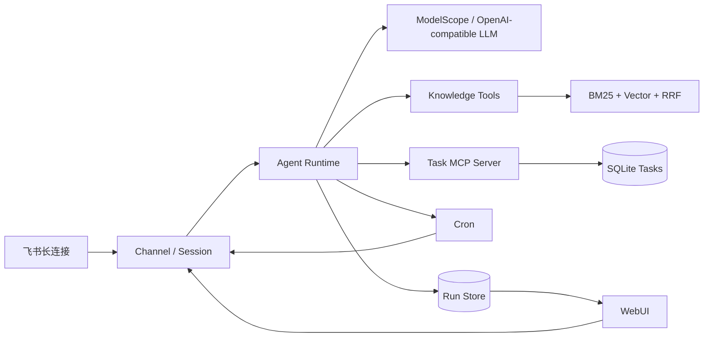

# OmniAgent

> 面向个人与小团队的自托管私有知识与任务自动化 Agent。

[](https://github.com/oo000o/OmniAgent/actions/workflows/ci.yml)


OmniAgent 将本地文档问答、结构化任务、定时自动化与飞书/WebUI 双端交互连接成一条
可追踪的工作流。它不仅回答问题，还能依据带出处的知识创建任务、可靠更新状态，并在
指定时间把结果送回原会话。

## 演示场景

将岗位 JD、学习计划或项目资料加入知识库，然后在飞书中发送：

> 根据学习计划创建本周三个任务，每天检查进度，并标出任务依据。

OmniAgent 会完成以下流程：

1. 检索私有资料，并返回可核对的 `[K1]`、`[K2]` 引用。
2. 通过独立 MCP 服务创建结构化任务。
3. 使用幂等键避免模型重试产生重复任务。
4. 保存定时检查，并在触发后回复原飞书会话。
5. 在 WebUI 中展示相同任务和完整运行详情。

## 核心能力

- **私有知识库**：本地文档解析、SQLite FTS5/BM25、向量检索、RRF 排名融合与稳定引用。
- **任务 MCP**：创建、查询、分页筛选、更新与取消；使用 Pydantic 约束工具参数。
- **可靠写操作**：幂等键防重复、乐观锁防覆盖、高风险取消操作要求显式确认。
- **跨端连续性**：WebUI 与飞书共享持久化知识和任务状态；飞书使用长连接，无需公网 IP。
- **定时自动化**：Cron 记录来源渠道，执行后将结果回传原会话。
- **可观测性**：记录运行状态、耗时、Token、工具调用、重试和错误。
- **自托管部署**：Docker Compose 一键启动，数据和配置保存在本地。

## 系统架构



## 工程验证

当前发布基线已经过真实飞书链路、容器运行和 GitHub Actions 验证：

| 验证项 | 结果 |
| --- | --- |
| 确定性离线评测 | **60 / 60** |
| GitHub Actions | **8 / 8 jobs 通过** |
| Python 矩阵 | 3.11、3.14、Windows 3.14 |
| 前端与终端 | WebUI、Linux TUI、Windows TUI |
| 容器 | 非 root 运行、健康检查、持久化与镜像内评测通过 |
| 飞书 | 长连接、消息收发、知识引用、任务工具与定时回传通过 |

评测语料是透明、可复现的工程 fixture，不代表生产流量或虚构业务数据。

## 快速启动（Docker）

### 1. 准备环境变量

```powershell
Copy-Item .env.omniagent.example .env.omniagent
```

编辑 `.env.omniagent`：

```dotenv
MODELSCOPE_API_KEY=你的魔搭令牌
FEISHU_APP_ID=你的飞书应用ID
FEISHU_APP_SECRET=你的飞书应用密钥
FEISHU_OPEN_ID=允许使用机器人的用户OpenID
NANOBOT_WEB_TOKEN=至少32位的随机字符串
```

`.env.omniagent` 已被 Git 忽略，请勿提交任何真实凭据。

### 2. 构建并启动

```powershell
docker compose -f docker-compose.yml -f docker-compose.omniagent.yml build nanobot-gateway
docker compose -f docker-compose.yml -f docker-compose.omniagent.yml up -d nanobot-gateway
docker compose -f docker-compose.yml -f docker-compose.omniagent.yml ps
```

启动后访问：

- WebUI：<http://127.0.0.1:8765>
- 健康检查：<http://127.0.0.1:18790/health>

查看日志：

```powershell
docker compose -f docker-compose.yml -f docker-compose.omniagent.yml logs -f nanobot-gateway
```

详细配置与飞书权限步骤见
[`docs/omniagent-cross-channel-workflow.md`](./docs/omniagent-cross-channel-workflow.md)。

## 本地开发与评测

项目要求 Python 3.11 或更高版本。安装开发依赖后运行：

```bash
python -m evaluation.run
pytest
```

离线评测报告生成在 `artifacts/evaluation/latest.json`，该目录不会提交到 Git。

更多工程说明：

- [项目设计与验收](./docs/omniagent-project.md)
- [任务 MCP 设计](./docs/omniagent-task-mcp.md)
- [跨渠道工作流](./docs/omniagent-cross-channel-workflow.md)
- [评测说明](./evaluation/README.md)

## 技术栈

Python · FastAPI · Pydantic · SQLite/FTS5 · RAG · MCP · Feishu · React · TypeScript ·
Docker · GitHub Actions

## 安全与隐私

- 文档内容只作为不可信证据，不能覆盖系统指令。
- 文件工具可限制在工作区内，服务接口使用令牌鉴权。
- 配置模板只包含占位符；真实密钥、数据库、知识文件与运行记录默认不进入版本控制。
- 发布前请再次执行凭据扫描，并确认飞书应用的可用范围。

安全问题请参阅 [SECURITY.md](./SECURITY.md)。

## 项目来源与许可证

OmniAgent 在开源项目 [HKUDS/nanobot](https://github.com/HKUDS/nanobot) 的通用 Agent
Runtime、渠道与工具扩展点上开发，并新增私有知识领域层、混合检索与引用、任务 MCP、
跨端自动化、运行观测和独立评测门禁。

项目遵循 [MIT License](./LICENSE)，上游作者与第三方组件声明见
[LICENSE](./LICENSE) 和 [THIRD_PARTY_NOTICES.md](./THIRD_PARTY_NOTICES.md)。
