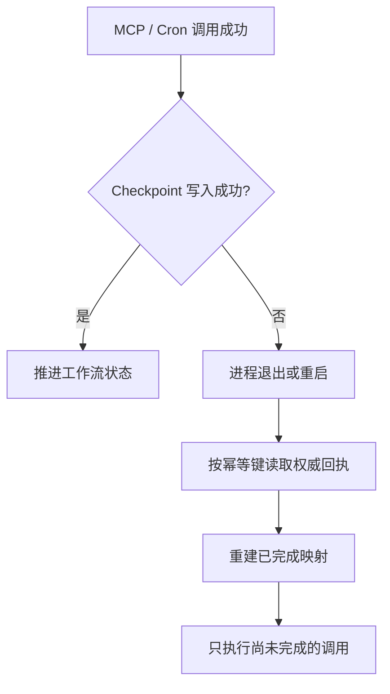

# 求职工作流：工程设计与面试核验指南

本文只描述仓库中已经实现、能够由代码或测试核验的能力。它不是产品宣传稿，也不把
离线受控评测描述成生产效果。

## 1. 要解决的问题

用户上传简历和岗位 JD 后，系统需要从两份私有文档中找到证据，分析能力差距，生成
学习计划；只有用户明确确认后，才能通过 MCP 创建真实任务并安排后续检查。模型输出
本身不能证明副作用成功，SQLite 中的任务记录和工具回执才是事实来源。

这条链路包含三类状态：

- 对话状态：帮助模型理解本轮语境，可以丢失或重新生成。
- 工作流检查点：记录当前阶段、证据、计划、真实任务 ID 和定时任务 ID。
- 业务事实：任务 MCP 的 SQLite 数据和 Cron 存储，是副作用是否完成的依据。

## 2. 状态机与提交边界

```text
documents_ready
      |
      | 检索简历/JD，保存真实 chunk_id
      v
evidence_retrieved -> gaps_analyzed -> plan_verifying
                                           |       ^
                              验证失败     |       | 限次修订并记录 diff
                                           v       |
                                      replanning --+
                                           |
                                      验证通过
                                           v
                                awaiting_confirmation
                                           |
                                           | 原始用户消息确认当前 plan_revision
                                           v
                                      confirmed
                                           |
                                           | 生成待执行清单
                                           v
                                    tasks_creating
                                      |         ^
                       MCP 创建成功 |         | 重启后从 SQLite 对账
                                      v         |
                                    tasks_created
                                           |
                                           | 创建绑定来源渠道的 Cron
                                           v
                                       scheduled
                                           |
                                           | 所有真实任务均为 done
                                           v
                                       completed
```

每次变更都携带 `expected_version`。如果另一个请求已经更新记录，旧请求会收到冲突，
必须重新读取后再决定是否重试，避免模型用旧状态覆盖新状态。

## 3. 为什么不是单纯调用 API

### 证据约束

工作流只接受本次上传的简历和 JD。检索结果必须来自允许的绝对路径，并将
`evidence_id`、`source_type`、`source_name`、`chunk_id` 写入检查点。Gap 必须引用已保存
证据，不能只凭模型记忆生成。

### 副作用核验

创建任务分为“生成执行清单”和“登记结果”两步。登记时，系统会回查共享 TaskStore：

1. task_id 必须真实存在；
2. 每个计划项必须恰好对应一个任务；
3. 任务 source 必须是 `career:<workflow_id>:<plan_item_id>`；
4. 模型不能直接把任意 ID 写进检查点。

求职工作流与任务 MCP 必须配置为同一个 SQLite 文件。例如 Docker 示例中，两者均使用
`/data/workspace/.nanobot/tasks.db`。若指向不同文件，任务即使已被 MCP 创建，工作流也
必须拒绝登记其 ID；这是事实源隔离错误，而不是可忽略的模型重试。

### 幂等与恢复

任务创建使用稳定幂等键；如果 MCP 已写入 SQLite、进程却在检查点更新前退出，恢复时
会按 source 从 TaskStore 重建回执，不重复创建任务。Cron 也采用相同思路：先检查已
持久化的 job，再决定创建还是补记检查点。同一恢复动作重复执行三次，仍只保留一条
Task 或一条 Cron。

失败恢复路径：



```text
Tool 成功 → Checkpoint 写入失败 → 重启 → 查询幂等回执 → 重建已完成映射 → 仅执行剩余调用
```

```text
MCP/Cron 提交成功
        |
        v
Checkpoint 写入? --否--> 进程退出/重启
        |                      |
        是                     v
        |              按幂等键读取权威回执
        v                      |
推进工作流状态                 重建已完成映射
                               |
                               v
                      只生成尚未完成的调用
```

### 有界重规划与人在回路

候选计划必须显式列出其覆盖的 Gap。确定性 Verifier 会拒绝未覆盖目标、引用未知能力或
存在重复标题的计划；LLM 只能修改被拒绝的未确认计划，最多修订两次。每次修订都会保存
旧计划、新计划、触发规则、原因和增删改 item ID。超过上限后工作流以
`REPLAN_EXHAUSTED` 失败，不进入无限循环。

确认工具读取 runtime 保存的原始用户消息，检查明确确认，而不是相信模型转述
“用户同意了”。确认同时绑定具体 `plan_revision`；未确认或确认版本落后时，工作流不能
进入任务创建阶段。

## 4. 已覆盖的异常边界

- 非法 JSON、空查询、数量超限：在工具入口拒绝。
- 检索越界到其他知识文档：按允许路径过滤。
- Gap 引用不存在的证据：拒绝状态迁移。
- 候选计划没有覆盖缺失能力：进入有界重规划，不展示给用户确认。
- 重规划超过两次：以 `REPLAN_EXHAUSTED` 终止。
- 用户确认旧计划版本：乐观锁拒绝执行。
- 模型伪造用户确认：拒绝状态迁移。
- 模型提供不存在的 task_id：回查 SQLite 后拒绝。
- 重放相同任务创建：返回已有任务，不产生重复副作用。
- 任务创建中途重启：从已持久化任务恢复剩余执行清单。
- 使用过期 version 并发更新：乐观锁冲突，要求重新读取。
- 任务未全部完成却关闭工作流：拒绝完成。
- Cron 已创建但检查点未写入：按来源信息恢复绑定。
- 同一 Task/Cron 恢复三次：不重复创建副作用。
- Replan 在 Checkpoint 前中断：重启后仍停留在旧 `plan_revision`，重放后才进入新版本。
- 用户确认的是 v1、当前已是 v2：`VERSION_CONFLICT`，禁止执行。
- Embedding 不可用：在允许降级时回退 BM25，并标记 `retrieval_fallback`。
- Trace 与日志：不落简历/JD 原文、完整查询或凭证。

## 5. 可复现证据

运行：

```bash
python -m evaluation.run
```

当前受控基线为 92/92，其中求职工作流 17 个场景：成功路径 9、边界拒绝 4、恢复路径
4；运行观测 8 个场景；故障注入 7 个场景覆盖重复恢复、Replan 中断、旧版本确认拒绝、
Embedding 降级和隐私省略。检索夹具还分别报告 BM25、向量
和混合 RRF 的 Recall@3、MRR、NDCG@3。

这些数字证明实现对固定夹具的可重复行为，不证明线上准确率、生产可用性或真实用户
收益。真实飞书凭证链路仍应通过发布清单单独验收。

运行记录现在保存最小 Trace：`run_id → workflow_id → plan_revision → step → tool →
result/error/retry`。工具明细只含名称、起止时间、成败、错误码和恢复/降级/重规划标
记；不保存简历/JD 原文、完整查询、完整工具参数或凭证。聚合接口
`/api/omniagent/runs/summary` 输出样本数、成功率、Avg/P95 延迟和工具成功率。P95 是
当前仓库样本分位数，不是生产 SLA。

错误码与处置：`VALIDATION_ERROR` 拒绝，`VERSION_CONFLICT` 重新读取后重试，
`REPLAN_EXHAUSTED` 转人工，`RETRIEVAL_ERROR` 可降级到 BM25，`MCP_ERROR` 按幂等回执
重试，`CHECKPOINT_ERROR` 从权威存储恢复。

## 6. 面试官最可能追问

**为什么不能让模型直接创建三个任务后回答成功？**  因为模型文本不是事务回执；请求
可能超时、工具可能失败、模型也可能虚构结果。系统必须以 MCP 返回值和共享 SQLite
中的记录为准，再推进检查点。

**为什么同时需要幂等键和乐观锁？**  幂等键解决同一意图重放导致的重复写入；乐观锁
解决不同意图并发修改同一记录导致的丢失更新，两者处理的故障不同。

**MCP 在这里解决什么？**  它统一模型发现和调用任务工具的协议边界，使任务服务可与
Agent Runtime 分离。它不负责持久化；重启后任务仍存在，是因为 SQLite 挂载在持久化
存储上。

**RAG 做到了哪一层？**  已完成文档切分与索引、BM25/向量召回、RRF 融合、稳定引用、
检索评测和工作流证据绑定；没有把离线夹具指标包装成生产数据，也没有声称完成大规模
向量数据库性能工程。

**进程在 MCP 成功后、checkpoint 前崩溃怎么办？**  恢复逻辑以 TaskStore 中带稳定
source 的记录为事实，重建已完成映射，只生成尚未完成的调用。

## 7. 简历 STAR 口径（全部验收后）

**S/T：** 面向私有资料分散、模型副作用不可直接信任的问题，设计 WebUI/飞书双端的
求职准备 Agent，将“简历/JD 分析—计划确认—任务执行—定时跟进”变成可追踪流程。

**A：** 实现 SQLite FTS5/BM25、向量召回与 RRF 融合，并把真实 chunk 引用绑定到 Gap；
以 MCP 隔离任务领域，通过 Pydantic 校验、幂等键、乐观锁、原始消息确认和副作用回查
约束模型写操作；设计 SQLite checkpoint 状态机，在任务或 Cron 已提交但进程退出时
完成对账恢复；将离线评测、pytest、Docker 和严格静态检查接入 GitHub Actions。

**R：** 在 92 条确定性离线用例中通过 92 条，其中求职工作流 17/17、运行观测 8/8、
故障注入 7/7；12 条检索夹具上
向量 Recall@3/MRR/NDCG@3 为 1.0/1.0/1.0，混合 RRF 为
1.0/0.9583/0.9692，并验证重复创建、伪造 task_id、过期版本和中断恢复等边界。

只有当最新 GitHub Actions 全部通过时，才在简历或项目页写“CI 全部通过”。

## 8. 真实缺陷复盘：LLM 改写附件路径导致 PDF 读取失败

### 现象

用户通过飞书上传 `简历-范懿(2).pdf` 后，Agent 回复 PDF 解析工具不可用，并建议用户
复制粘贴正文。运行记录中既出现了 `read_file` 失败，也出现了对 `fitz`、`PyPDF2` 的
探测，因此表面上很像容器缺少 PDF 依赖。

### 定位过程

没有直接按照模型结论安装依赖，而是依次核对三类事实：

1. 检查飞书附件是否真实落盘，确认实际文件名为 `简历-范懿(2).pdf`；
2. 对比模型提交给工具的参数，发现它调用的是 `简历 - 范懿 (2).pdf`，擅自在连字符和
   括号附近加入了空格；
3. 在容器内核对运行依赖并绕过模型直接调用项目解析链路，确认 `pypdf` 已安装，且使用
   正确路径可以从该 PDF 提取一页、1443 个字符。

根因不是 PDF 解析器缺失，而是**渠道提供的确定性附件路径经过 LLM 后被改写**。后续
依赖探测是模型在首次文件读取失败后的错误归因。

### 修复策略

- 在 `read_file` 工具描述中明确要求原样复制附件路径，降低模型改写概率；
- 当且仅当目标位于媒体目录、原路径不存在且同目录下只有一个规范化文件名匹配时，
  容忍常见标点两侧的空白差异；
- 使用 Unicode NFKC 规范化处理全角/兼容字符，但不做任意相似度或跨目录搜索；
- 若存在多个候选文件则继续报错，不猜测用户想读取哪一个；解析后的真实路径还必须
  位于媒体根目录内，避免符号链接越界。

这里没有采用模糊文件名搜索，因为它可能把错误输入静默映射到另一份敏感附件。该方案
只恢复可证明唯一的轻微格式偏差，保留了失败可见性和最小权限边界。

### 验证结果

- 使用原先失败的错误路径复测，运行中的 Docker Agent 能唯一定位真实 PDF 并提取
  1443 个字符；
- 新增中文文件名恢复和多候选拒绝测试；
- 相关测试结果为 80 passed、5 skipped，Ruff 与 BasedPyright 检查通过；
- 修复只覆盖文本型 PDF 的路径定位，不把扫描件 OCR 描述成已实现能力。

### 面试口述（约 60 秒）

我遇到过一次飞书上传 PDF 后 Agent 误报解析库缺失的问题。开始看起来像容器依赖不全，
但我没有相信模型生成的诊断，而是先检查附件落盘、工具实参和容器依赖。最后发现真实
文件名是 `简历-范懿(2).pdf`，LLM 调用工具时却在标点附近加了空格；项目其实已经安装
`pypdf`，正确路径可以正常解析。修复时我没有做宽泛的模糊搜索，而是在媒体目录内仅对
标点空白做规范化，并要求候选唯一；歧义时仍然失败，同时校验解析路径不越出媒体根目录。
我还补了成功恢复和多候选拒绝测试，并在 Docker 中用原失败路径完成回归。这个问题让我
进一步明确：LLM 适合做决策，但附件路径、工具回执这类确定性数据不能让模型自由改写。

## 9. 真实缺陷复盘：飞书附件与文字竞态导致串读和缓存复用

### 现象

飞书把“上传文件”和“随后发送处理要求”作为两个独立事件投递。文件下载较慢时，后发
文字可能先进入 Agent，导致模型从统一会话历史中选择上一份附件。第一次修复事件顺序
后，又发现文件事件会在文字指令到达前单独启动模型；同名文件重复上传时，模型还可能
直接复用上一轮读取结果，而没有读取本轮文件。

### 定位过程

通过容器日志与持久化会话逐条对齐事件时间、模型请求和工具调用：

1. 文件事件先开始下载，文字事件却先发布到消息总线，证明存在异步超车；
2. 串行化后，文件先进入模型，但用户文字只能在第一次工具调用后注入，说明仅保证顺序
   仍不足以表达“附件与指令属于同一轮”；
3. 附件和文字合并后，模型在重复上传同名 PDF 时零次调用 `read_file` 即给出答案，说明
   原路径覆盖与历史工具结果共同造成了陈旧证据复用。

其中一次文件事件触发了无关的求职工作流调用，但工具返回文档不存在；随后回查工作流
和任务 SQLite，数量均未变化。这里以工具回执和数据库为准，没有把模型最终答对当成
链路正确。

### 修复策略

- 按飞书会话串行处理入站事件，防止慢文件下载被后发文字超越；
- 文件下载后暂存最多 15 秒，与同一用户、同一会话紧随其后的文字合并为一次入站请求；
- 15 秒内没有文字时仍发布单独文件，避免永久吞掉只上传附件的用法；
- 同名附件不再覆盖旧文件，而是使用消息 ID 生成独立路径，确保每次上传都有独立证据；
- 对本轮非图片附件增加“读取前不得复用同名历史结果”的上下文标记，并继续要求工具
  使用精确路径。

### 验证结果

最终真实飞书测试中，日志显示附件与文字在同一条入站消息内；新 PDF 保存到带消息 ID
的独立路径，Agent 对该路径执行且只执行一次 `read_file` 后返回标题。测试窗口内没有
旧附件读取、求职工作流、任务或 Cron 调用；工作流与任务表记录数在测试前后均保持 3。
相关通道、附件和配置回归为 231 passed、7 skipped。

### 面试口述（约 90 秒）

我在真实飞书验收中发现，用户上传新简历并马上发处理要求时，Agent 虽然最后答对了，
日志却显示它先读取了会话里的旧简历。根因是飞书把文件和文字拆成两个事件，文件下载
期间后发文字发生异步超车。最初我按会话串行化事件后，旧文件串读消失了，但文件事件
仍会在文字到达前启动模型，甚至受历史上下文影响调用无关工作流；继续修复为短时间暂存
文件，并把同一会话后续文字与附件合并成一个 Agent turn。随后我又用同名文件复测，发现
模型可能复用历史读取结果，所以把重复上传保存为带消息 ID 的独立路径，并明确当前附件
必须重新读取。最终日志证明模型只对新路径调用一次 `read_file`，没有旧附件或副作用
工具调用，任务和工作流数据库也没有变化。这个问题体现了渠道事件时序、会话记忆和工具
证据三者必须一起验证，不能只看最终回答是否正确。

## 10. 部署缺陷复盘：配置刷新失败却打印成功

Docker Desktop 的 Windows 绑定目录允许创建新文件，但直接用 `cp` 截断并覆盖已有
`config.json` 会返回 `Permission denied`。原启动脚本没有检查 `cp` 的退出码，仍继续
打印“refreshed”，使服务带着旧配置启动；健康检查和飞书连接均正常，因此仅看存活状态
无法发现配置未生效。

修复后，启动脚本先把模板复制到同目录临时文件，再通过 `mv` 原子替换目标；初始化和
覆盖两条路径都检查结果，失败时删除临时文件并退出，不再静默使用陈旧配置。部署前保留
了旧配置备份。实测启动日志不再出现复制权限错误，配置文件更新时间发生变化，网关健康，
飞书与 MCP 均重新连接。
